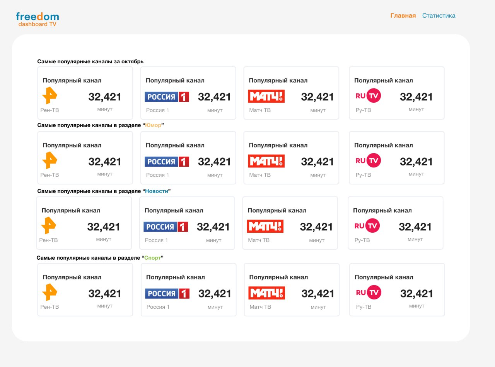
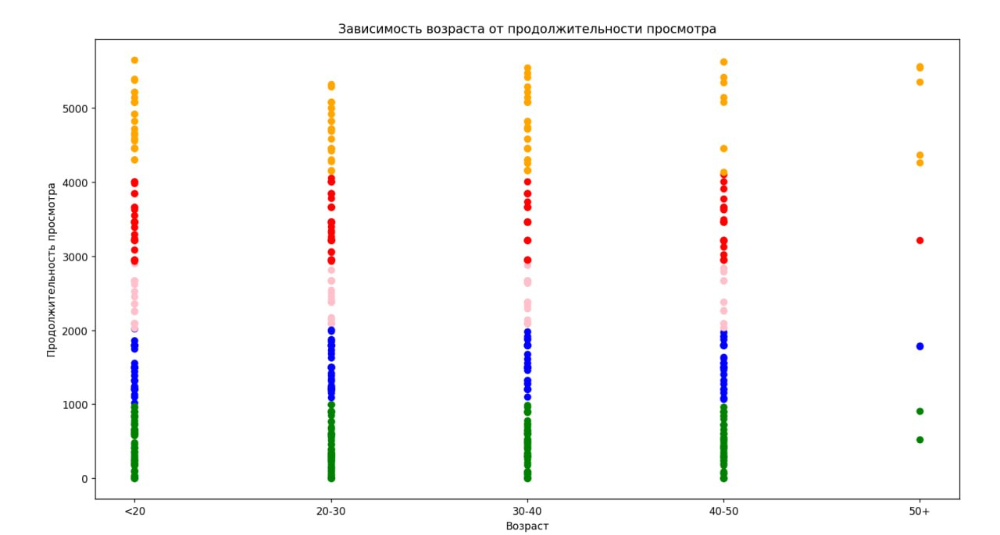

# FreedomDashboardTV - [Ссылка на развернутый веб-сервис](http://freedom-dashboard-tv.ru)

## Команда "Любители ДИКСИ"

## Состав
* [Братышев Тимофей](https://github.com/TaimonFix) - Руководитель команды, разработчик
* [Березин Ярослав](https://github.com/BerezinYaroslav) - Разработчик
* [Исаченко Богдан](https://github.com/Doctorian-Bogdan) - Разработчик
* [Ляшенко Егор](https://github.com/egrdze) - Дизайнер
* [Свиридов Данила](https://github.com/dansvr25) - Менедджер

## Тема
Наше веб-приложение решает проблему анализа предпочтений клиентов и подбора по ним персонализированных предложений

## Ссылки на приложение (локально развернутое)
* [Веб-сервис](http://localhost:5173)
* [Swagger](http://localhost:8080/swagger-ui/index.html#/)
* [Консоль Minio](http://localhost:9000)

## Сервисы
* [Видео-демонстрация](https://drive.google.com/file/d/1PKbynk1DGh2mXtfKgbWZBsFmnE7vK32Z/view?usp=sharing)
* [Figma](https://www.figma.com/board/biT8SkzqGvvkH52GVWjzvo/%7B02%7D-%7B%25D0%259B%25D1%258E%25D0%25B1%25D0%25B8%25D1%2582%25D0%25B5%25D0%25BB%25D0%25B8-%25D0%2594%25D0%2598%25D0%259A%25D0%25A1%25D0%2598%7D?node-id=4022-1110&node-type=table&t=fgs4fJUfPLyeo1cv-0)
* [Презентация](https://drive.google.com/file/d/1ZaHZFkrgaV5PT30-VEZUFAWXcY1jhxcK/view?usp=drive_link)
* [Исходные csv-файлы](https://drive.google.com/drive/folders/1CBA3F3PWR7cYBzd05fxEMS-Ze_0VKMy0?usp=drive_link)

## Архитектура (компоненты системы)

## Один из макетов

## Один из графиков кластерного анализа

